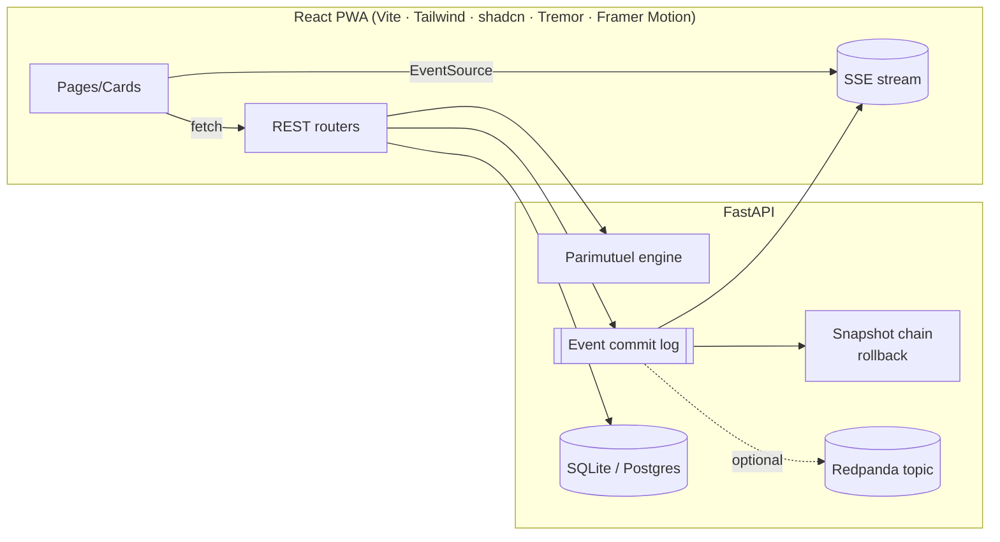
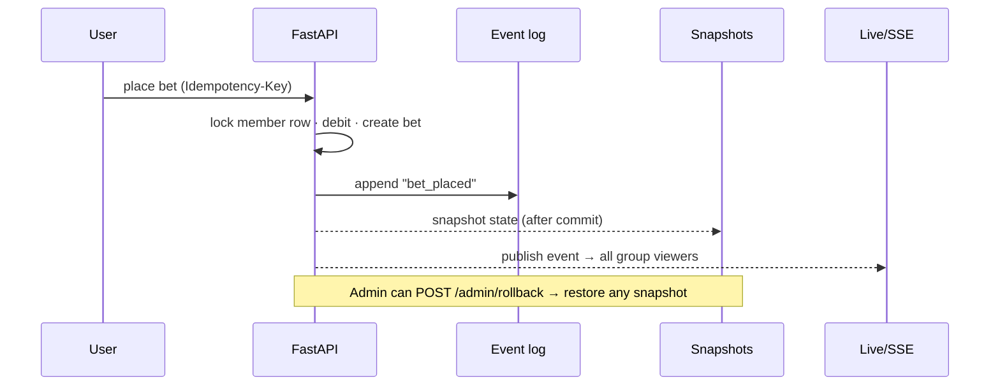

# PoolBet

Parimutuel prediction markets for friend groups. Everyone pools credits, anyone
proposes a YES/NO market, people bet against each other, and when it resolves the
**winning side splits the whole pot** in proportion to their stake — no house, no
order book. Play‑money only, so no gambling/payments surface.

> **Live demo:** the app is served at `/` (React). Test accounts below.

---

## Features

- **Parimutuel markets** — odds emerge from the pool: implied `P(YES) = yes_pool / (yes_pool + no_pool)`.
- **Fractional (scalar) settlement** — resolve YES/NO *or* a split % (e.g. YES 65%); the pot divides proportionally.
- **Trust‑but‑verify resolution** — proposer marks the outcome → **dispute window** → undisputed settles, disputed goes to a **group vote**. Proposer can force‑settle early.
- **Event‑sourced commit log** — every action is appended to an immutable log; an **admin dashboard** can **roll the whole app back** to any snapshot.
- **Live everything (SSE)** — bets fan out in real time; odds bars pulse and a **banter feed** updates live.
- **Anonymous bets** (stable temp nicknames), **buy‑ins**, **rules** + **photo evidence** per market, **group timeline**, **stats** (leaderboard, P&L, volume, probability history).
- **Deep links + QR**, invite codes, non‑member **request‑access** flow.
- **PWA** — installable, offline shell, **Web Push**, mobile‑first (safe‑area, `dvh`, 44px targets), haptics.
- **Hardening** — strict DB transactions on bets, idempotency keys, rate limiting, input sanitization, name+password + **Google OAuth** scaffold.

## Test accounts

| Name | Password | Role |
|------|----------|------|
| `Ava` | `test1234` | group owner / **admin** |
| `Ben` · `Cy` · `Dee` | `test1234` | members |

Group **Test League** is pre‑seeded with markets + bets. Re‑seed with `./.venv/bin/python scripts/seed_test_data.py`.

## Architecture



The frontend is a no‑build‑time‑coupled SPA talking to FastAPI over same‑origin
REST + one SSE stream per group. `DATABASE_URL` swaps SQLite → Postgres.

## The commit log (event sourcing)

Every mutation appends an `Event`; an `after_commit` hook snapshots full domain
state and fans the event out to SSE (and Redpanda, if configured). Rollback
restores a snapshot, then appends a `rollback` event — the log only moves forward.



## Parimutuel settlement (the core)

`app/engine.py` is a pure, unit‑tested module. Winners split the post‑rake pot
pro‑rata; scalar outcomes split it by fraction. Refund‑all guards: `VOID`, a
one‑sided market, or no winning stakes. Credits are conserved to the cent.

## Tech stack

| Layer | Choice |
|---|---|
| Frontend | React + TypeScript · Vite · Tailwind · shadcn/ui · **Tremor** (charts) · Framer Motion · HashRouter |
| Backend | FastAPI · SQLAlchemy 2 · Pydantic v2 |
| Data | SQLite (dev) / Postgres · Alembic migrations |
| Live | Server‑Sent Events (in‑proc broker) · optional **Redpanda** stream |
| PWA | Service worker · Web Push (VAPID) · manifest |
| Security | slowapi rate limiting · PBKDF2 · input sanitization · idempotency |

## Design decisions

- **Parimutuel, not an order book** — no liquidity needed; trivially fair for small groups.
- **Play credits** — sidesteps gambling/payments regulation entirely.
- **Event log as source of truth** — auditability + one‑click rollback for free; SSE and Redpanda are just consumers of the same stream.
- **SSE over WebSockets** — one‑way fan‑out is all we need; simpler, auto‑reconnects, works through the tunnel.
- **HashRouter** — client routes never collide with the root‑path REST API.
- **Mobile‑first** — `dvh`/safe‑area/44px baked into the design system; OLED‑dark default with emerald/pink accents.

## Run locally

```bash
# backend
python3.12 -m venv .venv && source .venv/bin/activate
pip install -r requirements.txt
POOLBET_ADMIN_NAMES=Ava uvicorn app.main:app --reload      # :8000  (serves the built frontend at /)

# frontend (dev, hot reload — proxies the API to :8000)
cd frontend && npm install && npm run dev                  # :5173
npm run build                                              # emits frontend/dist → served by FastAPI at /
```

Optional infra: `REDPANDA_BROKERS=localhost:9092` (see `app/redpanda.py` for the
one‑line `docker run`); `GOOGLE_CLIENT_ID/SECRET` to enable Google sign‑in;
`VAPID_*` for push (else auto‑generated to `.vapid.json`).

## Tests

```bash
pytest -q          # engine (splits, rake, refunds, conservation) + full API lifecycle + auth + idempotency + rollback
```
